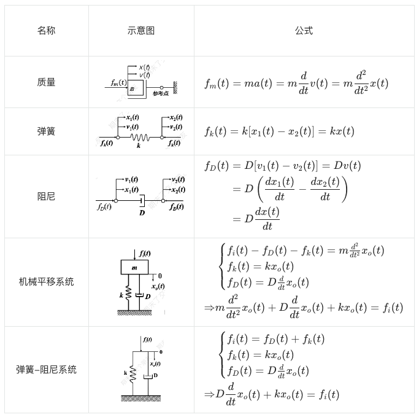
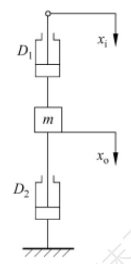
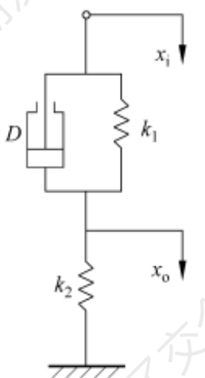
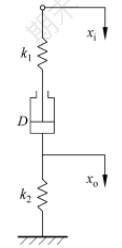
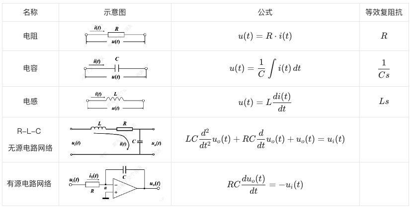
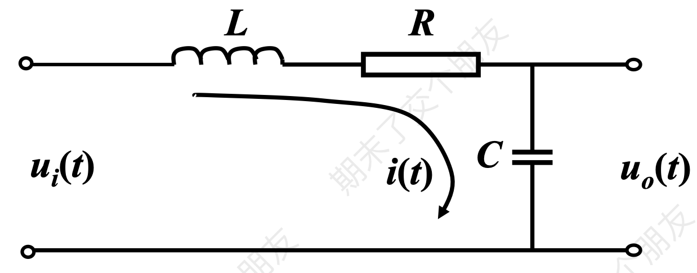
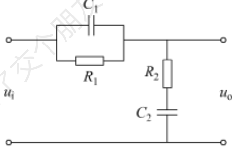
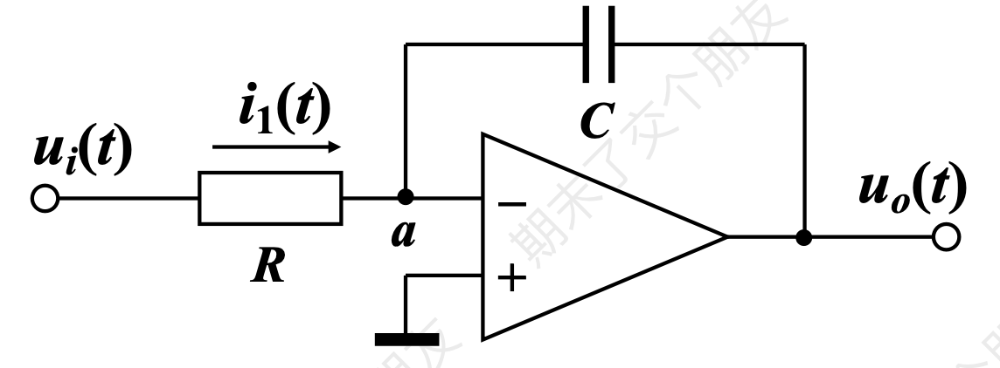
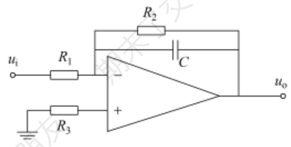

## 传递函数

在零初始条件下，线性定常系统输出量的拉氏变换与引起该输出的输入量的拉氏变换之比。其参数仅取决于系统本身的结构及参数，与系统的输入形式无关，表征了系统内在的固有动态特性。

其一般形式为：

$$
G(s) = \frac{X_o(s)}{X_i(s)} = \frac{b_{0}s^m+b_{1}s ^{m-1}+\dots+b_{m-1}s+b_{m}}{a_{0}s^n+a_{1}s^{n-1}+\dots+a_{n-1}s+a_{n}} = \frac{b_{0}(s-z_{1})(s-z_{2})\dots(s-z_{m})}{a_{0}(s-p_{1})(s-p_{2})\dots(s-pn)}
 = \frac{N(s)}{D(s)}
 $$

其中，$D(s) = 0$成为系统的特征方程，其根称为系统的特征根。特征方程决定着系统的动态特性，其最高阶次等于系统的阶次。

当$s = 0$时，$G(0) = \frac{b_m}{a_n} = K$称为系统的静态放大系数或静态增益。

其中$N(s) = b_0(s-z_1)(s-z_2)\cdots(s-z_n)$的根$z_i$称为传递函数的零点，$D(s)=a_0(s-p_1)(s-p_2)\cdots(s-p_n)$称为传递函数的极点

::: tip
例：设单位反馈控制系统的开环传递函数为$G_k(s) = \frac{0.4s+1}{s(s+0.5)}$，则系统的开环零点为 -2.5，开环极点为 0、-0.5
:::

### 经典环节及其传递函数

| 环节 | 传递函数 |
| --- | --- |
| 比例环节 | $K$ |
| 一阶微分环节 | $\tau s+1$ |
| 二阶微分环节 | $\tau^2s^2+2\zeta Ts + 1$ |
| 积分环节 | $\frac{1}{s}$ |
| 惯性环节 | $\frac{1}{Ts+1}$ |
| 振荡环节 | $\frac{1}{T^{2}s^{2}+2\zeta Ts+1}$ |
| 延迟环节 | $e^{-\tau s}$ |

## 数学模型

### 建立数学模型的一般步骤

分析系统工作原理和信号传递变换的过程，确定系统和各元件的输入、输出量；

从输入端开始，按照信号传递变换过程，依据各变量遵循的物理学定律，依次列写出各元件、部件的动态微分方程；

消去中间变量，得到描述元件或系统输入、输出变量之间关系的微分方程；

对方程进行标准化，右端输入，左端输出，导数降幂排列。

### 机械系统的数学模型

:::: details 例题1（机械系统的数学模型）

::: tabs

@tab 题 1

解：有$D_{1}[\dot{x}_{i}(t)- \dot{x}_{o}(t)] - D_{2}\dot{x}_{o}(t) = m\ddot{x}(t)$

得$ms^{2}X_{o}(s)+(D_{1}+D_{2})sX_{o}(s)=D_{1}sX_{i}(s)$

故$\frac{X_{o}(s)}{X_{i}(s)} = \frac{D_{1}s}{ms^{2}+(D_{1}+D_{2}s)s}$

@tab 题 2

解：有
$$
\begin{cases}
k_{1}[x_{i}(t) - x_{o}(t)] + D[\dot{x}_{i}(t) - \dot{x}_{o}(t)] = k_{2}x_{o}(t) \\
(k_{1}+k_{2})x_{o}(t)+D\dot{x}(t)=k_{1}x_{i}(t)+D\dot{x}(t) \\
\end{cases}
$$

得 $(k_{1}+k_{2})X_{o}(s)+DsX_{o}(s)=k_{1}X_{i}(s)+DsX_{i}(s)$
故 $\frac{X_{o}(s)}{X_{i}(s)}=\frac{Ds+k_{1}}{Ds+k_{1}+k_{2}}$

@tab 题 3

解：设$k_1$和$D$之间的位移为$x(t)$

有$k_{1}[x_{i}(t)-x(t)]=D \frac{d(x(t)-x_{o}(t))}{dt}=k_{2}x_{o}(t)$

得$k_{1}[X_{i}(s)-X(s)]=Ds[X(s)-X_{o}(s)]=k_{2}X_{o}(s)$

故$\frac{X_{o}(s)}{X_{i}(s)}=\frac{k_{1}Ds}{(k_{1}+k_{2})Ds+k_{1}k_{2}}$
:::
::::

### 电路系统的数学模型

::::: details 例题2（电路系统的数学模型）

:::: tabs

@tab 题 1

求R-L-C 无源电路网络的传递函数。

解：

**拉氏变换法**

$$
\begin{align}
& \begin{cases}
u_{i}(t) =Ri(t)+L \frac{d}{dt}i(t)+\frac{1}{C}\int i(t) \, dt \\
u_{o}(t)=\frac{1}{C}\int i(t) \, dt \to i(t) = C \frac{du_{o}(t)}{dt}
\end{cases} \\
\Rightarrow & LC \frac{d^{2}}{dt^{2}}u_{o}(t) + RC \frac{d}{dt}u_{o}(t) + u_{o}(t) = u_{i}(t)
\end{align}
$$

对等式的两边进行拉氏变换得：$LCs^{2}U_{o}(s) + RCsU_{o}(s) + U_{o}(s) = U_{i}(s)$

整理得$G(s) = \frac{U_{o}(s)}{U_{i}(s)} = \frac{1}{LCs^{2}+RCs+1}$

**等效复阻抗法**

$G(s) = \frac{U_{o}(s)}{U_{i}(s)} = \frac{\frac{1}{Cs}}{Ls + R + \frac{1}{Cs}}$

@tab 题 2 

求R-L-C 无源电路网络的传递函数。

解：

**等效复阻抗法**

$$
\begin{align}
G(s) &= \frac{U_{o}(s)}{U_{i}(s)} = \frac{R_{2} + \frac{1}{C_{2}s}}{R_{1} \parallel \frac{1}{C_{1}s}+R_{2}+\frac{1}{C_{2}s}}  \\ \\
	&= \frac{R_{2}+\frac{1}{C_{2}s}}{\frac{R_{1}}{R_{1}C_{1}s+1}+R_{2}+\frac{1}{C_{2}s}} \\
	&= \frac{R_{1}R_{2}C_{1}C_{2}s^{2}+(R_{1}C_{1}+R_{2}C_{2})s+1}{R_{1}R_{2}C_{1}C_{2}s^{2}+(R_{1}C_{1}+R_{2}C_{2}+R_{1}C_{2})s+1}
\end{align}
$$

@tab 题 3

求R-L-C 有源电路网络的传递函数。

**拉氏变换法**

由$RC \frac{du_{o}(t)}{dt} = -u_{i}(t)$可得$RCsU_{o}(s) = -U_{i}(s)$

故$G(s) = \frac{U_{o}(s)}{U_{i}(s)} = -\frac{1}{RCs}$

**等效复阻抗法**

$G(s) = \frac{U_{o}(s)}{U_{i}(s)} = \frac{-\frac{1}{Cs}}{R} = -\frac{1}{RCs}$

@tab 题 4

求R-L-C 有源电路网络的传递函数。

解：

**等效复阻抗法**

$$
G(s) = \frac{U_{o}(s)}{U_{i}(s)} = \frac{-R_{2} \parallel \frac{1}{Cs}}{R_{1}} = -\frac{\frac{R_{2}}{R_{2}Cs + 1}}{R_{1}} = -\frac{R_{2}}{R_{1}R_{2}Cs+R_{1}}
$$

::::
:::::