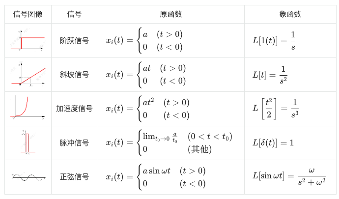
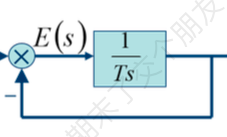
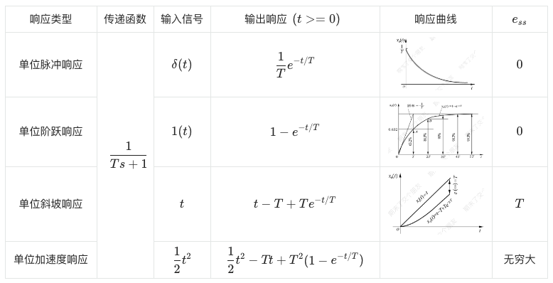
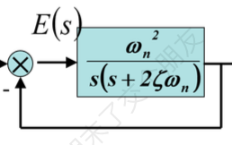
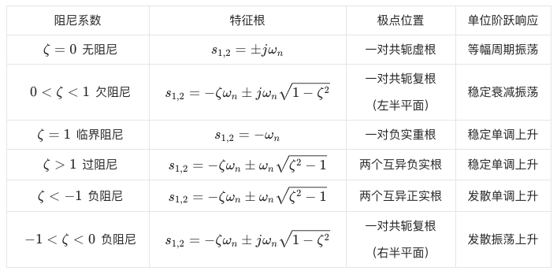
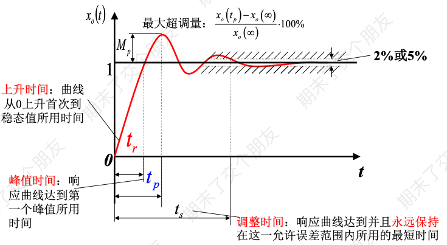
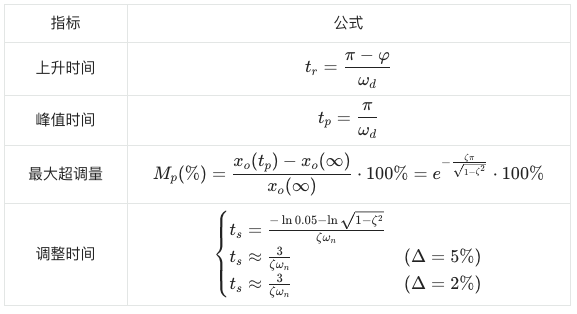

时域分析指控制系统在一定的输入下，根据输出量的时域表达式，分析系统的稳定性、瞬态和稳态性能。

系统输出量的时域表示可由线性微分方程得到，也可由传递函数得到。

瞬态性能指标是以阶跃信号为典型输入信号定义的。
## 典型输入信号

## 一阶系统的瞬态响应

一阶系统指能够用一阶微分方程描述的系统，它的典型形式是一阶惯性环节。

$$
T \frac{dx_{0}(t)}{dt}+x_{0}(t)=x_{i}(t)
$$

$$
\frac{X_{o}(s)}{X_{i}(s)}=\frac{1}{Ts+1}
$$

**系统响应的计算方法**

对输入信号进行拉氏变换，通过传递函数后进行拉氏反变换得到输出响应

等价关系

系统对输入信号导数的响应，将等于系统对该输入信号响应的导数；

系统对输入信号积分的响应，就等于系统对该输入信号响应的积分。

::: details 例题1（一阶系统的瞬态响应）

设单位反馈系统的开环传递函数为$G(s) = \frac{4}{s(s + 5)}$，求该系统的单位阶跃响应和单位脉冲响应。

解：由题可知单位反馈系统的闭环传递函数为

$G_{k}(s) = \frac{G(s)}{1+G(s)} = \frac{\frac{4}{s(s+5)}}{1+\frac{4}{s(s+5)}}=\frac{4}{s^{2}+5s+4}=\frac{4}{(s+1)(s+4)}$

当$x_i(t) = 1(t)$时，$X_i(s) = \frac{1}{s}$，

故$X_{o}(s) = X_{i}(s) \cdot G_{k}(s) = \frac{1}{s} \cdot\frac{4}{(s+1)(s+4)} = \frac{1}{s} - \frac{4}{3}\cdot \frac{1}{s+1}+\frac{1}{3}\cdot \frac{1}{s+4}$

则$x_{o}(t) = \left( 1 - \frac{4}{3}e^{-t}+\frac{1}{3}e^{-4t} \right)\cdot {1}(t)$

当$x_{i}(t) = \delta(t)$时，$X_i(s) = 1$，

故$X_{o}(s) = X_{i}(s) \cdot G_{k}(s) = 1 \cdot\frac{4}{(s+1)(s+4)} = \frac{4}{3}\cdot \frac{1}{s+1}-\frac{4}{3}\cdot \frac{1}{s+4}$

则$x_{o}(t) = \left( \frac{4}{3}e^{-t}-\frac{4}{3}e^{-4t} \right)\cdot {1}(t)$
:::

## 二阶系统的瞬态响应

二阶系统指用二阶微分方程描述的系统，它的形式是二阶振荡环节。

形式一：$\frac{X_{o}(s)}{X_{i}(s)} = \frac{\omega_{n}^{2}}{s^{2}+2\zeta\omega_{n}s+\omega^{2}}$，其中$\zeta$为阻尼比；$\omega_n$为无阻尼自振角频率

形式二：$\frac{X_{o}(s)}{X_{i}(s)} = \frac{1}{T^{2}s^{2}+2\zeta Ts+1}$，其中$T = \frac{1}{\omega_n}$

::: tip
例：二阶系统传递函数为$\frac{1}{4s^{2}+4s+1}$，则$T=2$、$\omega_n = 0.5$、$\zeta=1$
:::

二阶系统特征方程：$s^{2}+2\zeta\omega_{n}s+\omega^{2}=0$，特征方程的根$s_{1, 2} = -\zeta\omega_{n} \pm \omega \sqrt{ \zeta^{2}-1 }$
### 二阶系统的极点分布

### 阻尼系数与特征根的关系

一般希望二阶系统工作在$\zeta = 0.4$到$0.8$的欠阻尼状态。理想阻尼比为$0.707$

:::tip
例：某反馈系统的特征方程为$s^{2}+2Ks+5=0$，若要系统产生临界振荡，则$K=0$
:::

::: details 例题2（二阶系统的阻尼系数）

求如图所示的闭环传递函数，并求出闭环阻尼比为$0.5$时所对应的$K$值。

解：$G(s) = \frac{X_{o}(s)}{X_{i}(s)} = \frac{\frac{K}{s(0.1s + 1)}}{1 + \frac{K}{s(0.1s+1)}} = \frac{K}{0.1s^{2}+s+K} = \frac{10K}{s^{2}+10s+10K}$

故$\omega_n = \sqrt {10K}$，且$2\zeta\omega_{n} = 2\zeta \sqrt{ 10K } = 10$，当闭环阻尼比$\zeta = 0.5$时，解得$K = 10$
:::

::: details 例题3（二阶系统的瞬态响应）

单位阶跃输入情况下，测得某伺服机构的响应为$x_{o}(t) = 1 + 0.2e^{-60t} - 1.2e^{-10t}$。

1.  求出闭环传递函数
2. 求出系统的无阻尼自振角频率及阻尼比。

解：已知输入为单位阶跃输入$x_{i}(t) = 1(t)$，则$X_{i}(s) = \frac{1}{s}$

已知响应输出为$x_{o}(t) = 1 + 0.2e^{-60t} - 1.2e^{-10t}$，则$X_{o}(s) = \frac{1}{s} + \frac{0.2}{s + 60}  - \frac{1.2}{s + 10} = \frac{600}{s(s + 60)(s + 10)}$

故 $G(s) = \frac{X_{o}(s)}{X_{i}(s)} = \frac{600}{(s + 60)(s + 10)} = \frac{(10\sqrt{ 6 })^{2}}{s^{2}+2\times \frac{7\sqrt{ 6 }}{12}\times 10\sqrt{ 6 } + (10\sqrt{ 6 })^{2}}$

可知无阻尼自振角频率$\omega_n = 10\sqrt{6}(rad/s)$，阻尼比$\zeta = \frac{7\sqrt{6}}{12}$
:::

## 时域分析性能指标

时域分析性能指标是以系统对单位阶跃输入的瞬态响应形式给出的。
### 二阶系统的瞬态响应指标

二阶振荡环节的形式为$\frac{X_{o}(s)}{X_{i}(s)} = \frac{\omega_{n}^{2}}{s^{2}+2\zeta\omega s+\omega_{n}^{2}}$，考虑$0 < \zeta < 1$的情况，即欠阻尼状态，系统特征方程存在一对共轭复根 $s_{1, 2} = -\zeta \omega_{n} \pm j\omega_{n}\sqrt{ 1 - \zeta^{2} } = -\zeta\omega n \pm j \omega_{d}$。

当输入为单位阶跃输入时，其瞬态响应为：

$x_{o}(t) = \left( 1 - \frac{e^{-\zeta\omega_{n}t}}{\sqrt{ 1-\zeta^{2} }}\sin(\omega_{d}t + \varphi) \right) \cdot 1(t)$

其中$\varphi$为复根与虚轴的夹角，如图：

我们可以得到瞬态响应曲线如图：

::: details 例题4（二阶系统的瞬态响应指标）

某系统如图所示，试求其无阻尼自振角频率$\omega_n$，阻尼比$\zeta$，超调量$M_p$，峰值时间$t_p$，调整时间$t_s$（进入$\pm5\%$的误差带）

解：$\frac{X_{o}(s)}{X_{i}(s)} = \frac{\frac{100}{s(50s+4)}}{1 + \frac{100}{s(50s + 4)}\cdot_{0}.02} = \frac{100}{50s^{2}+4s+2} = \frac{2}{s^{2}+2\times 0.2 \times 0.2s + 0.04}$

故$\omega_{n} = 0.2$、$\zeta = 0.2$

$M_{p} = e^{-\frac{\zeta \pi}{\sqrt{ 1-\zeta^{2} }}}\cdot 100\% \approx 52.7\%$

$t_{p} = \frac{\pi}{\omega _{d}} = \frac{\pi}{\omega_{n}\sqrt{ 1-\zeta^{2} }} \approx 16.23(s)$

$t_{s} \approx \frac{3}{\zeta\omega_{n}} = 75(s)$
:::

::: details 例题5（二阶系统的瞬态响应指标）

某单位反馈系统的开环传递函数为$G(s) = \frac{K}{s(s+10)}$，当阻尼比为$0.5$时，求$K$值，并求单位阶跃输入时该系统的调整时间、最大超调量和峰值时间。

解：$\frac{X_{o}(s)}{X_{i}(s)} = \frac{\frac{K}{s(s+10)}}{1 + \frac{K}{s(s + 10)}} = \frac{K}{s^{2}+10s+K} = \frac{K}{s^{2}+2\times 0.5 \times 10s + K}$

故$\omega_{n} = 10$，$K = \omega^{2}=100$

可知$t_{s} = \frac{-\ln 0.05 - \ln \sqrt{ 1-\zeta^{2} }}{\zeta\omega_{n}} \approx 0.63s$

$M_{p} = e^{-\frac{\zeta \pi}{\sqrt{ 1-\zeta^{2} }}}\cdot 100 \% = 16.3 \%$

$t_{p} = \frac{\pi}{\omega_{d}} = \frac{\pi}{\omega _{n}\sqrt{ 1-\zeta^{2} }} \approx 0.363s$
:::

