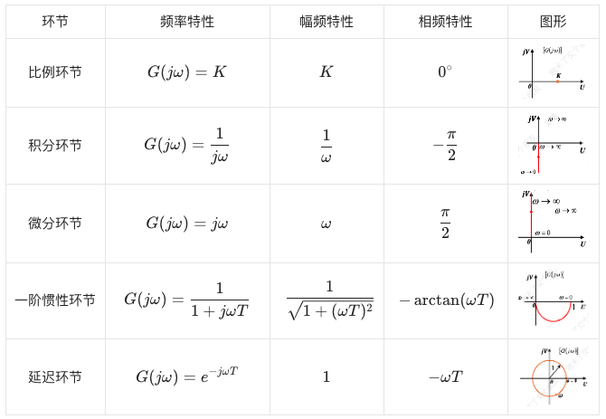
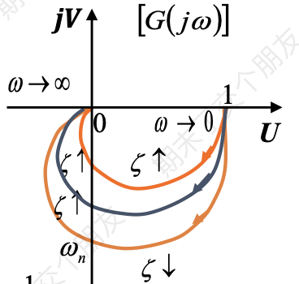
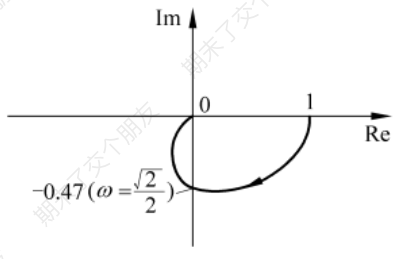
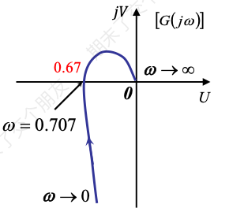

极坐标图是反映频率特性的几何表示。

它是当角频率从 $\omega$ 从 $0$ 逐渐增加到 $+\infty$ 时，矢量 $|G(j\omega)|\cdot e^{j\varphi(\omega)}$ 的端点在 $[G(j\omega)]$ 复平面（频域）上相对应的轨迹。

逆时针为正

## 典型环节的 Nyquist 图

:::tip
例：延时环节$e^{-3s}$的相频特性$\varphi(\omega) = 3-\omega$。
:::

| 环节 | 备注 |
| --- | --- |
| 比例环节 | 理想的放大环节能够无失真和无滞后地复现输入信号 |
| 积分环节 | 积分环节对正弦信号有$90^{\circ}$的滞后作用。 |
| 微分环节 | 微分环节对正弦输入有$90^{\circ}$的超前作用。 |
| 延迟环节 | 相角$0^{\circ} \sim -\infty^{\circ}$，与实轴和虚轴有无穷多交点 |

### 二阶振荡环节的 Nyquist 图

已知二阶振荡环节的传递函数为$G(s) = \frac{1}{T^{2}s^{2} + 2\zeta Ts + 1}$，则其频率特性为$G(j\omega) = \frac{1}{T^{2}(j\omega)^{2} + 2\zeta T(j\omega) + 1}$，可得：

$$
\begin{align}
|G(j\omega)|  & = \frac{1}{\sqrt{ (1 - T^{2}\omega^{2})^{2} + (2\zeta T\omega)^{2} }} \\
\angle G(j\omega)  & = \begin{cases}
-\arctan \frac{2\zeta T\omega}{1 - T^{2}\omega^{2}}  & \omega \leq \frac{1}{T} \\
-\left( \pi - \arctan \frac{2\zeta T\omega}{T^{2}\omega^{2} - 1} \right) & \omega > \frac{1}{T}
\end{cases}
\end{align}
$$

其 Nyquist 图如下：

相角$0^{\circ} \sim -180^{\circ}$，与负虚轴有交点。令$\angle G(j\omega) = -90^{\circ}$，得$\omega = \frac{1}{T} = \omega_n$，$G(j \omega_n) = \frac{1}{2\zeta}\angle -90^{\circ}$为负虚轴交点。

## 绘制乃氏图

1. 写出幅频特性和相频特性表达式
2. 分别求出$\omega$趋近与$0$和$\infty$时的频率特性
3. 求乃氏图与实轴的交点，令$Im[G(j\omega)] = 0$或令$\angle G(j\omega) = n \cdot 180^{\circ}$求出
4. 求乃氏图与虚轴的交点，令$Re[G(j\omega)] = 0$或令$\angle G(j\omega) = n \cdot 90^{\circ}$求出
5. 必要时画出乃氏图中间几点
6. 勾画出大致曲线

::: details 例题1（乃氏图的绘制）
试画出$G(s) = \frac{1}{(s + 1)(2s + 1)}$的乃氏图

解：频率特性$G(j\omega) = \frac{1}{(j\omega + 1)(2 j\omega + 1)}$故

$$
\begin{cases}
|G(j\omega)| & = \frac{1}{\sqrt{ \omega^{2}+1 }\sqrt{ (2\omega)^{2} + 1 }} \\
\angle G(j\omega) & = -\arctan(\omega) - \arctan(2\omega)
\end{cases}
$$

当$\omega = 0$时，$G(j 0) = 1\angle 0^{\circ}$；当$\omega \to \infty$时，$G(j\infty) = 0 \angle -180^{\circ}$。

其相角范围从$-0^{\circ} \sim -180^{\circ}$，因此必有与负虚轴的交点

令$\angle G(j\omega) = -\arctan(\omega) - \arctan(2\omega) = -90^{\circ}$，即$\arctan(\omega) + \arctan(2\omega) = 90^{\circ}$

两角互余，正切互为倒数，故两边取正切，得$2\omega = \frac{1}{\omega}$，即$\omega = \sqrt{\frac{1}{2}} = \frac{\sqrt{2}}{2}$

:::

::: details 例题2（绘制乃氏图）
画出$G(s) = \frac{1}{s(s + 1)(2s + 1)}$的乃氏图。

解：$G(j\omega) = \frac{1}{j\omega(j\omega + 1)(2j\omega + 1)}$ ，故

$$
\begin{cases}
|G(j\omega)|  & = \frac{1}{\omega \sqrt{ \omega^{2} + 1 }\cdot \sqrt{ (2\omega)^{2} + 1 }} \\
\angle G(j\omega)  & = -90^{\circ} - \arctan(\omega) - \arctan(2\omega)
\end{cases}
$$

当$\omega = 0$时，$G(j\omega) = \infty \angle -90^{\circ}$；当$\omega \to \infty$时，$G(j\omega) = 0 \angle -270^{\circ}$

其相角范围从$-90^{\circ}\sim-270^{\circ}$，因此必有与负实轴的交点

令$\angle G(j\omega) = -90^{\circ} - \arctan(\omega) - \arctan(2\omega) = -180^{\circ}$，即$\arctan(2\omega) = 90^{\circ} - \arctan(\omega)$

两角互余，正切互为倒数，两边取正切，得得$2\omega = \frac{1}{\omega}$，即$\omega = \sqrt{\frac{1}{2}} = \frac{\sqrt{2}}{2}$

:::

