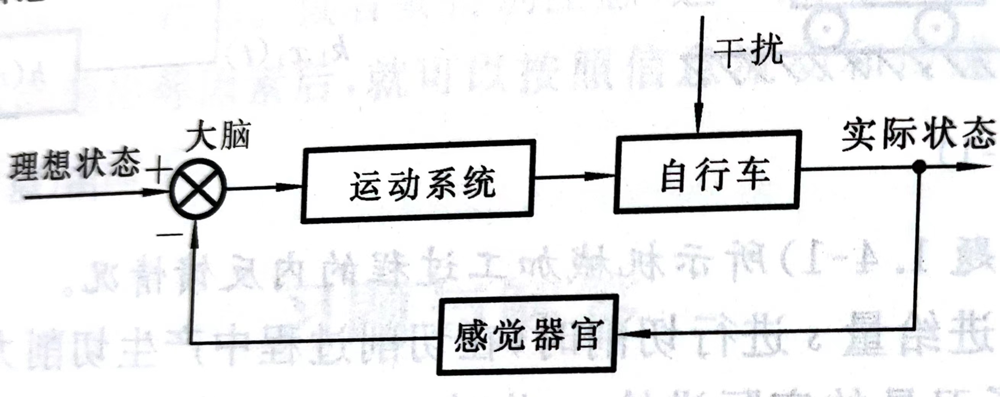
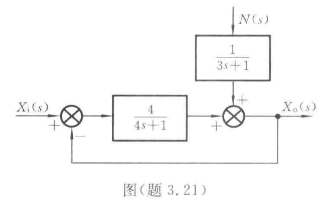
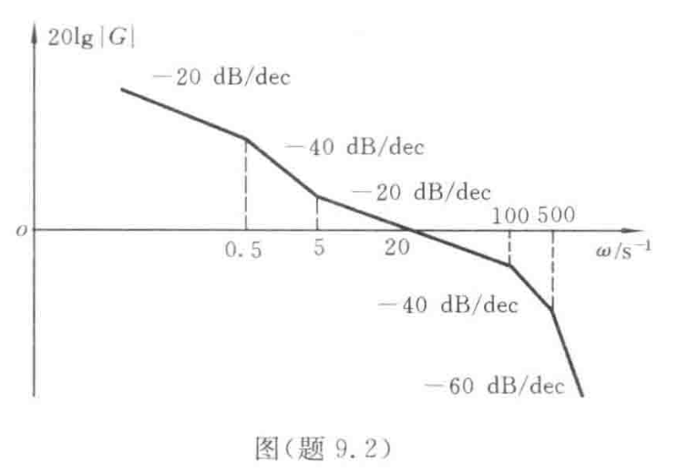

（第一题）画系统方框图，然后写一段话分析这个过程

解：人骑自行车时，总是希望自行车具有一定的理想状态（如速度、方向、安全等），人脑根据这个理想状态指挥四肢动作，使自行车按预定的状态运动。此时，路面的状况等因素会对自行车的实际状态产生影响，使自行车偏离理想状态，人的感觉器官感觉车子的状态，并将信息返回到大脑，大脑根据实际状态与理想状态的偏差调整四肢动作，如此循环往复。其信息流动与反馈的过程可用下图进行表示。同理，可以解释人驾驶汽车、行驶中的船等过程中存在的信息流动与反馈情况。

（第二题）RLC电路，列出微分方程，用复阻抗法得结果求出如图所示电系统的传递函数。

解：(a)设$i_1$为流过$R_1$的电流，$i$为总电流，则有：

$$
\begin{cases}
u_{o} = R_{2}i + \frac{1}{C_{2}}\int i \, dt  \\
u_{i} - u_{o} = R_{1}i_{1} \\
u_{i} - u_{o} = \frac{1}{C_{1}} \int (i - i_{1}) \, dt 
\end{cases}$，即：$\begin{align}
&C_{1}R_{2} \ddot{u}_{o} + \left( 1 + \frac{R_{2}}{R_{1}} + \frac{C_{1}}{C_{2}} \right)\dot{u_{o}} + \frac{1}{C_{2}R_{1}}u_{o}  \\
= &C_{1}R_{2}\ddot{u_{1}} + \left( \frac{R_{2}}{R_{1}} + \frac{C_{1}}{C_{2}} \right)\dot{u_{i}} + \frac{1}{C_{2}R_{1}}u_{i}
\end{align}
$$

(b)设$i$为电流，则有：

$$
\begin{cases}
u_{i} = u_{o} + R_{1}i + \frac{1}{C_{1}}\int i \, dt  \\
u_{o} = \frac{1}{C_{2}}\int i \, dt + R_{2}i 
\end{cases}$，即$(R_{1}+R_{2})\dot{u_{o}} + \left( \frac{1}{C_{1}} + \frac{1}{C_{2}} \right)u_{o} = R_{2}\dot{u_{i}} + \frac{1}{C_{2}}u_{i}
$$

（第三题）传递函数化简，梅逊公式的应用

（第四题）误差分析，稳态误差为 0 的系统分析如图所示系统，已知$X_i(s) = N(s) = \frac{1}{s}$，试求输入$X_i(s)$和干扰$N(s)$作用下的稳态误差。

解：令$x_i(t) = 0$，则系统只存在扰动，我们可以知道$\frac{\varepsilon_{N}(s)}{\frac{1}{3s + 1}N(s)} = -\frac{1}{1 + G(s)} = -\frac{4s + 1}{4s + 5}$，

故$\varepsilon_{N}(s) = -\frac{4s + 1}{4s + 5}\cdot \frac{1}{3s + 1}N(s) = -\frac{4s + 1}{s(4s + 5)(3s + 1)}$

有$\frac{\varepsilon_{N}(s)}{X_{i}(s)} = \frac{1}{1 + G(s)} = \frac{4s + 1}{4s + 5}$，故$\varepsilon_{N}(s) = \frac{4s + 1}{4s + 5}X_{i}(s) = \frac{4s + 1}{s(4s + 5)}$

该系统为单位反馈系统，故稳态误差等于稳态偏差，稳态误差等于输入引起的稳态误差和干扰引起的稳态误差之和。故：

$$
\begin{align}
e_{ss}  & = e_{ssX} + e_{ssN} = \varepsilon_{ssX} + \varepsilon_{ssN} \\
	 & = \lim_{ s \to 0 } s \cdot\varepsilon_{X}(s) + \lim_{ s \to 0}s\cdot\varepsilon_{N}(s) \\
	 & = \lim_{ s \to 0 } \frac{4s + 1}{4s + 5} - \lim_{ s \to 0 } \frac{4s + 1}{(4s+5)(3s+1)}  \\
	 & = \frac{1}{5} - \frac{1}{5} = 0
\end{align}
$$
（第五题）已知 Bode 图，求传递函数已知最小相位系统的对数幅频特性曲线的渐近线如图所示，求该系统的传递函数。

解：因低频段的斜率为$-20dB/dec$，故该系统为 I 型系统。

因对数幅频特性渐近线的斜率改变了四次，该系统具有四个带转折的典型环节（一个导前环节、三个惯性环节），即系统的传递函数可写为$G(s) = \frac{K(1 + T_{2}s)}{s(T_{1}s + 1)(T_{3}s + 1)(T_{4}s + 1)}$

其中
$$
\begin{align}
\omega_{T_{1}}  & = 0.5 s ^{-1}    & T_{1}  & = \frac{1}{\omega_{T_{1}}} = 2 s \\
\omega_{T_{2}}  & = 5 s ^{-1} &   T_{2}  & = \frac{1}{\omega_{T_{2}}} = 0.2s \\
\omega_{T_{3}}  & = 100 s ^{-1}  &   T_{3}  & = \frac{1}{\omega_{T_{3}}} = 0.01s \\
\omega_{T_{4}}  & = 500 s ^{-1} &   T_{4}  & = \frac{1}{\omega T_{4}} = 0.002s
\end{align}
$$

该系统为 I 型系统，$K = \omega_c$，因为$a = 20 \lg \frac{20}{5} dB = 12 dB$$b - a = 40 \lg \frac{5}{0.5}$

故$b = 52dB$，又有$\frac{52}{\lg \frac{\omega_c}{0.5}} = 40$，解得$K = \omega_c \approx 200$

故传递函数为$G(s) = \frac{200(1 + 0.2s)}{s(2 + 1)(0.01s + 1)(0.02s + 1)}$
（第六题）给出开环传递函数，用 Routh 判据求稳定性，随后画出 Nyquist 图

