## 非第一象限的顺、逆圆弧插补计算

逐点比较法的四个节拍：偏差判断、进给、偏差计算、终点判别

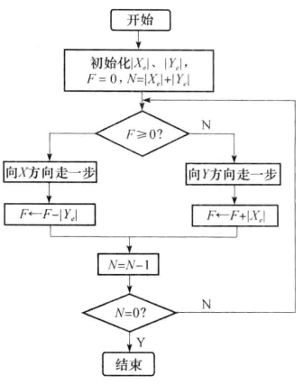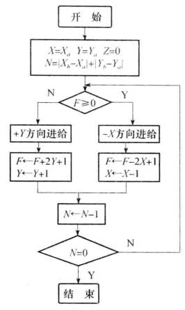

- 在第一象限中
   - 直线插补$\begin{cases}
F_{i + 1} = F_{i} - y_{e}   & (F_{i} \geq 0) \\
F_{i + 1} = F_{i} + x_{e}   & (F_{i} < 0)
\end{cases}$
   - 逆圆弧插补$\begin{cases}
F_{i + 1} = F_{i} - 2x_{i} + 1   & (F_{i} \geq 0) \\
F_{i + 1} = F_{i} + 2y_{i} + 1   & (F_{i} < 0)
\end{cases}$
   - 顺圆弧插补$\begin{cases}
F_{i + 1} = F_{i} - 2y_{i} + 1   & (F_{i} \geq 0) \\
F_{i + 1} = F_{i} + 2x_{i} + 1   & (F_{i} < 0)
\end{cases}$
- 其余象限中以原点作镜像变换
- 要考虑跨象限的情况

::: details 例 

圆弧插补设有第一象限逆圆弧$AB$，起点为$A(5, 0)$，终点为$B(0, 5)$，用逐点比较法进行插补计算，并绘制出插补轨迹。

解：插补所需的总步数$n = |5 - 0| + |0 - 5| = 10$

开始加工时刀具在起点，即在圆弧上，$F_0 = 0$，插补计算过程如表，插补轨迹如图：

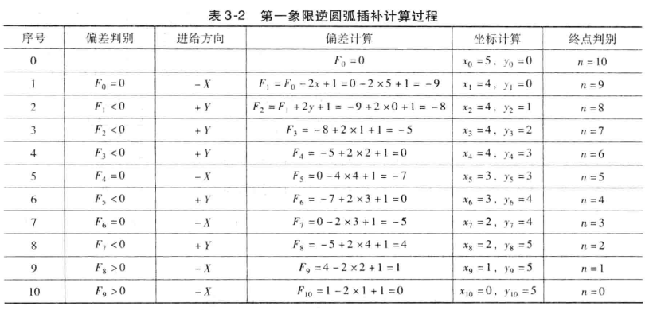

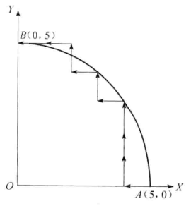
:::

## 数字积分法的直线插补

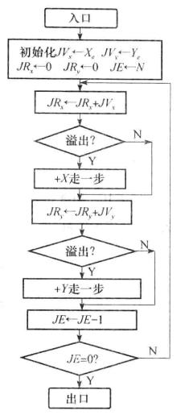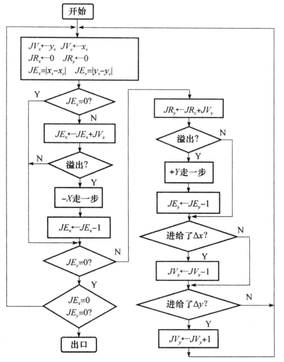

::: details 例 
直线插补设有一直线 OA，起点为坐标原点，终点 A 的坐标为$(4, 6)$。试用 DDA 法直线插补此直线。

解：$JV_x = 4$、$JV_y = 6$，选寄存器位数$N= 3$，则累加次数$m = 2^3 = 8$，插补计算过程如表，插补轨迹如图。

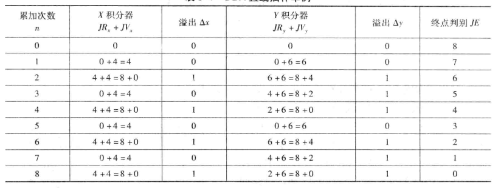

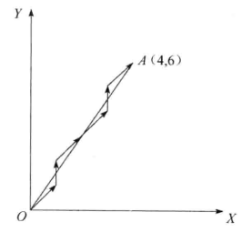
:::

## 刀补的三个作用

1. 在编程时可以不考虑刀具的半径，直接按图样所给尺寸编程，在实际加工时只要输入刀具的半径即可。
2. 简化粗加工程序的编制。通过改变刀具半径补偿量，则可用同一刀具、同一程序完成不同切削余量下的加工。
3. 刀具重磨或刀具磨损后半径变小的补偿。

## 刀补的三个步骤

1. 建立刀补
2. 刀补执行
3. 刀补撤销

## C 刀补补偿类型、判断方法、转接方法与轨迹计算

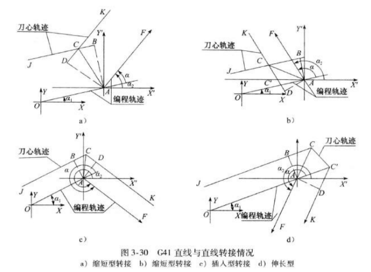

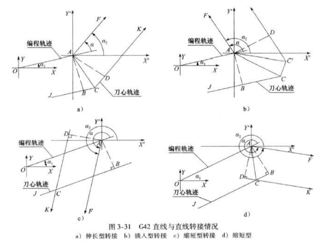

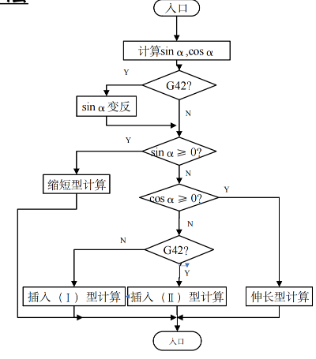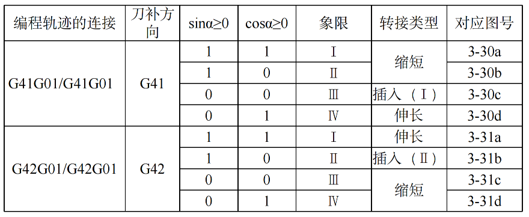

## 进给速度和加速度控制的特点与区别

要求：

- 足够的速度范围和灵活的指定方式
- 启动快而不失步，停止位置准备而不超程
- 必须按一定规律完成升速和降速的过程
- 防止产生冲击、失步、超程或振荡

在使用脉冲增量插补算法的开环系统中：

- 速度控制：控制向步进电机发出脉冲的频率
- 加速度控制：改变输入脉冲的时间间隔，加速时是脉冲串逐渐加密，减速时使脉冲串逐渐稀疏

在闭环或半闭环系统中：

- 速度控制：确定一个插补周期的轮廓步长
- 加速度控制：软件实现
