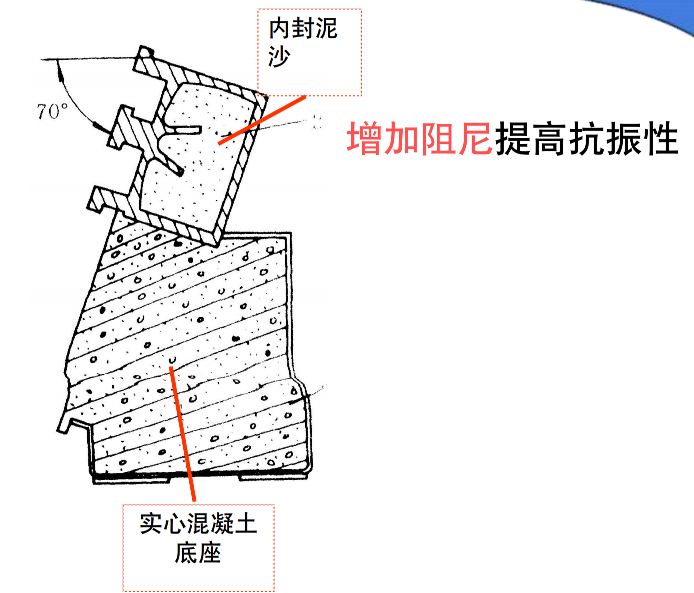
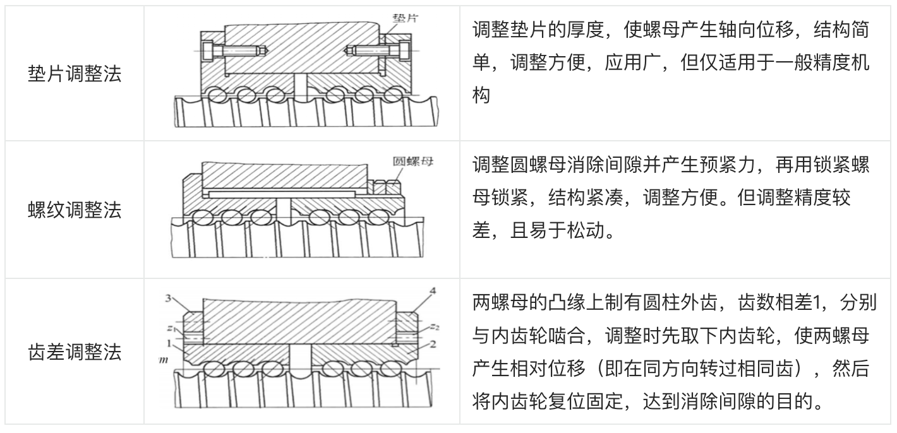
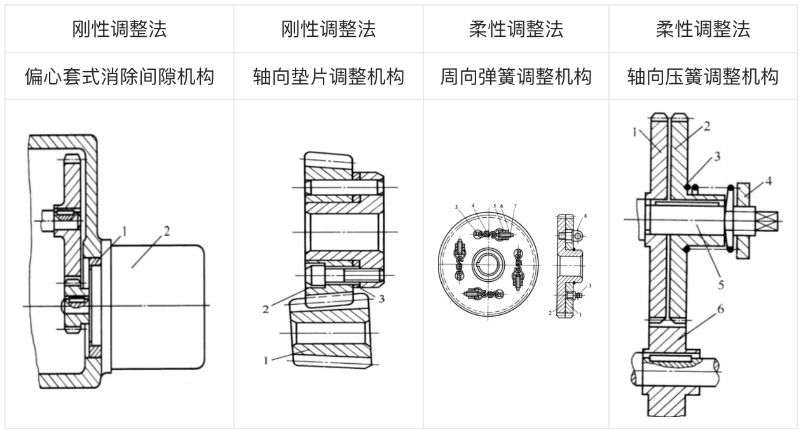

## 提高精、动刚度的措施

- 提高静刚度的措施
   - 基础大件采用封闭整体箱型结构
   - 合理布置加强筋
   - 提高部件之间的接触刚度

如图中，纵向隔板主要提高抗弯刚度，横向隔板主要提高抗扭刚度，斜向隔板兼具提高抗弯、抗扭刚度

- 提高动刚度的措施
   - 改善机床的阻尼特性（如填充阻尼材料）
   - 床身表面喷涂阻尼涂层
   - 充分利用结合面的摩擦阻尼
   - 采用新材料，提高抗震性

## 常用的预紧方法

## 齿差调整法计算

## 齿轮传动间隙调整方法

刚性调整法是一种调整后齿侧间隙不能自动补偿的调整方式。因此，齿轮的周节公差及齿厚要严格控制，否则传动的灵活性会受到影响。这种调整方式结构比较简单，且有较好的传动刚度。