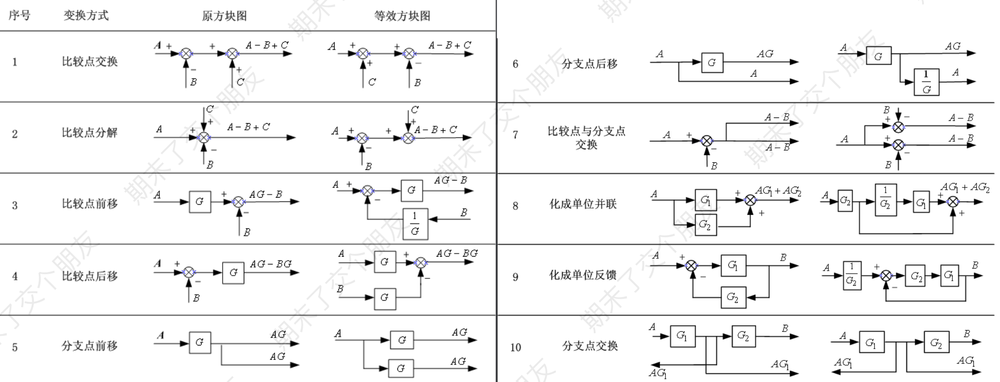
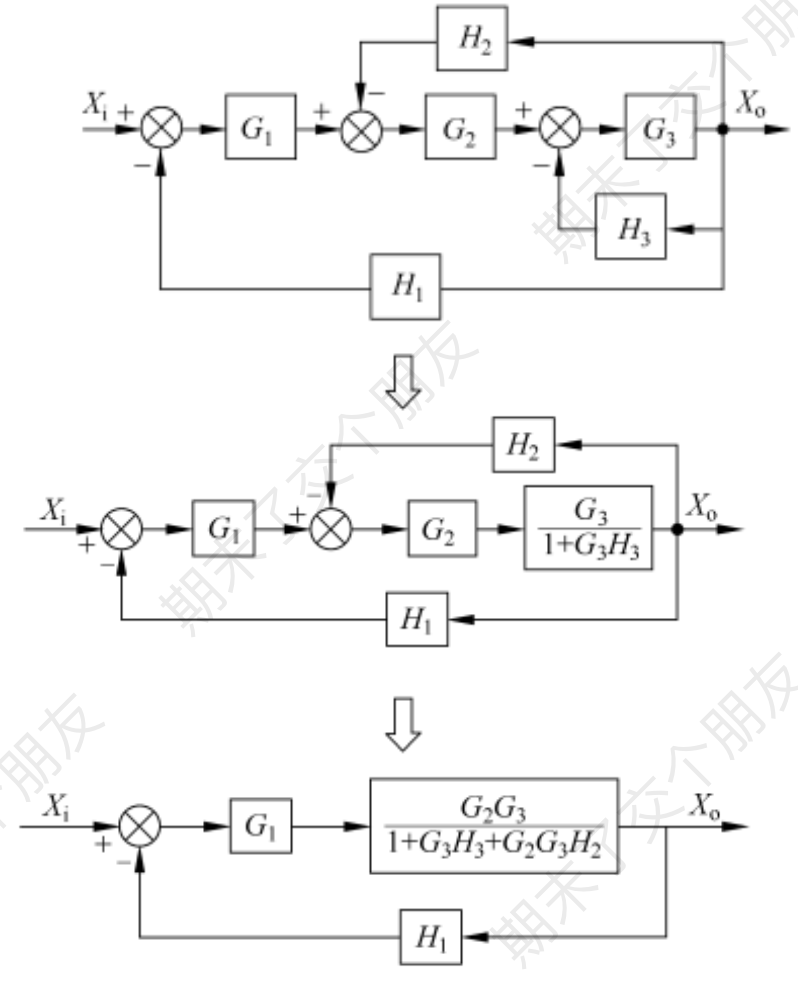

函数方块具有乘法运算功能，求和点具有加法运算功能

串联环节相乘、并联环节相加、反馈环节相叠
## 反馈环节的传递函数

假设前向通道传递函数为$G(s)=X_{o}(s)/E(s)$，反馈通道传递函数为$H(s)=B(s)/X_o(s)$，则反馈环节传递函数为$\frac{G(s)}{1 \pm G(s)H(s)}$，其中若为负反馈调节则为正号，正反馈调节则为负号。
## 方框图的变换法则

- 各前向通道传递函数的乘积不变
- 各回路传递函数的乘积保持不变

由内而外简化

