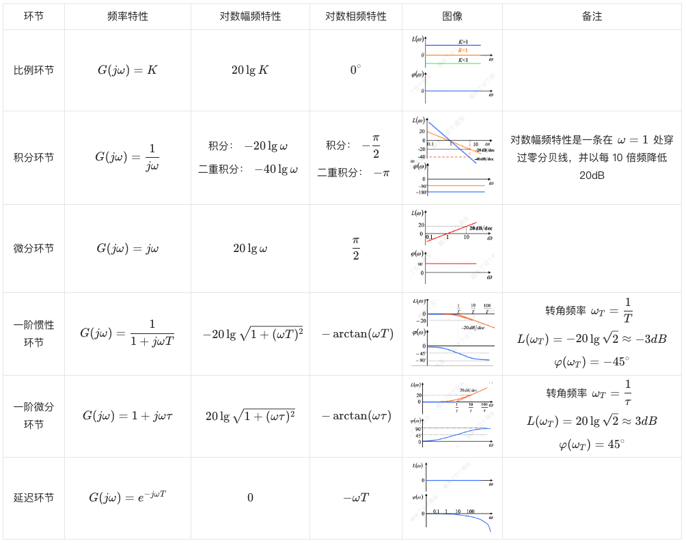

伯德图由两张图组成，纵坐标按线性分度，对数幅频特性为$L(\omega) = 20lg|G(j\omega)|$，对数相频特性为$\varphi(\omega)$，横坐标按对数分度，十倍频程，用 $dec.(decade)$表示。

简化了幅频特性中的乘除运算为加法运算。

$|G(j\omega)| = \frac{K\sqrt{ 1 + (\omega\tau_{1})^{2} }\sqrt{ 1 + (\omega\tau_{2})^{2} }\dots}{\omega^{\lambda}\sqrt{ 1 + (\omega T_{1})^{2} }\sqrt{ 1 + (\omega T_{2})^{2} }\dots}$

$$
\begin{align}
L(\omega) = 20lg|G(j\omega)| & = 20\lg k + 20 \lg \sqrt{ 1 + (\omega \tau_{1})^{2} } +20 \lg \sqrt{ 1 + (\omega \tau_{2}^{2}) } + \dots  \\
& - (\lambda 20 \lg w + 20 \lg \sqrt{ 1 + (\omega T_{1})^{2} }+ 20 \lg \sqrt{ 1 + (\omega T_{2}^{2}) } + \dots)
\end{align}
$$

## 典型环节的伯德图

### 二阶振荡环节

已知二阶振荡环节的传递函数为$G(s) = \frac{1}{T^{2}s^{2} + 2\zeta Ts + 1}$，则其频率特性为$G(j\omega) = \frac{1}{T^{2}(j\omega)^{2} + 2\zeta T(j\omega) + 1}$，可得：

对数幅频特性$L(\omega) = -20\log\sqrt{ (1 - T^{2}\omega^{2})^{2} + (2\zeta T\omega)^{2} }$

对数相频特性
$$ 
\angle G(j\omega) = \begin{cases}
-\arctan \frac{2\zeta T\omega}{1 - T^{2}\omega^{2}}  & \omega \leq \frac{1}{T} \\
-\left( \pi - \arctan \frac{2\zeta T\omega}{T^{2}\omega^{2} - 1} \right) & \omega > \frac{1}{T}
\end{cases}
$$

其其频率为转角频率$\omega = \frac{1}{T}$时，$L(\omega) -20\lg 2\zeta$，$\varphi(\omega) = -90^{\circ}$

其  Bode 图如下：

## 绘制伯德图

对数幅频特性曲线由各典型环节对数幅频特性叠加而成，相频特性曲线由各典型环节相频特性叠加而成。

1. 将系统传递函数写成标准形式（各环节常数项为 1），并求出其频率特性
2. 确定各典型环节的转角频率，并由小到大按其顺序标在横坐标上
3. 计算$20\lg K$，找到横坐标$\omega = 1$，纵坐标为$20\lg K$的点
4. 过点开始绘制折线，如有积分环节/二重积分环节，过该点做斜率为$-20 dB/dec$/$-40dB/dec$的斜线，以后每遇到一个转角频率便改变一次频率：
   1. 如遇惯性环节的转角频率，斜率增加$-20dB/dec$
   2. 如遇一阶微分环节的转角频率，斜率增加$+20dB/dec$
   3. 如遇振荡环节的转角频率，斜率增加$-40dB/dec$
   4. 如遇二阶微分环节的转角频率，斜率增加$+40dB/dec$
5. 根据误差修正曲线对渐近线进行修正。

::: details 例题1（无积分环节的伯德图绘制）
作传递函数为$G(s) = \frac{24(0.25s+0.5)}{(5s + 2)(0.05s + 2)}$的系统的 Bode 图。

解：化为标准形式$G(s) = \frac{24(0.25s+0.5)}{(5s + 2)(0.05s + 2)}$，包含一个比例环节、一个一阶微分环节，两个惯性环节串联组成。

已知频率特性为$G(j\omega) = \frac{3(0.5j\omega + 1)}{(2.5j\omega + 1)(0.025j\omega + 1)}$，求得各环节的转角频率：

- 一阶微分环节$1 + 0.5j\omega$，有$\omega_T = 1/0.5 = 2$
- 惯性环节$\frac{1}{1 + j 2.5\omega}$，有$\omega_T = 1/2.5 = 0.4$
- 惯性环节$\frac{1}{1 + j 0.025\omega}$，有$\omega_T = 1/0.025 = 40$

有$20\lg K = 20\lg 3 \approx 9.5$

:::

::: details 例题2（含积分环节的伯德图绘制）
作传递函数为$G(s) = \frac{25(1.2s + 2)}{s^{2}(4s + 1)}$的系统的 BOde 图。

解：化为标准形式$G(s) = \frac{50(0.6s + 1)}{s^{2}(4s + 1)}$，由一个比例环节，一个二重积分环节，一个一阶微分环节，一个惯性环节串联形成。

已知频率特性$G(j\omega) = \frac{50(0.6j\omega + 1)}{(j\omega)^{2}(4j\omega + 1)}$，求得各环节的转角频率：

- 一阶微分环节$1 + 0.6j\omega$，有$\omega_T = 1/0.6 = 1.67$
- 惯性环节$\frac{1}{1 + j4\omega}$，有$\omega_T = 1/4 = 0.25$

有$20\lg K = 20\lg 50 \approx 40$

:::

## 最小相位系统

系统开环传递函数在 S 右边平面上既无极点、又无零点的系统，称为最小相位系统；否则，为非最小相位系统。

最小相位系统的相频特性和幅频特性是一一对应的，大多数系统都是最小相位系统。

有延迟环节的系统属于非最小相位系统。

:::: details 例题3（最小相位系统的传递函数）
如图均是最小相位系统的开环对数幅频特性曲线，试写出开环传递函数。

::: tabs

@tab 题 1

解：$G(s) = \frac{1000\left( \frac{1}{400}s + 1 \right)}{\left( \frac{1}{2}s + 1 \right)\left( \frac{1}{200}s + 1 \right)\left( \frac{1}{4000}s + 1 \right)}$

@tab 题 2

解：$G(s) = \frac{100\left( \frac{1}{100}s + 1 \right)}{s^{2}\left( \frac{1}{1000}s + 1 \right)}$
:::

::::

