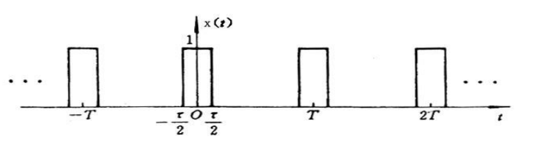
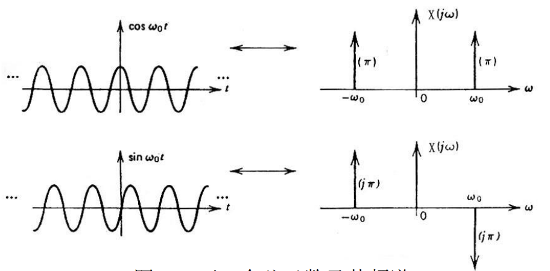

# 第一章 信号描述与分析基础

## 信号定义与分类

::: tip 如何区分确定信号和非确定性信号？

可以用明确数学关系式描述的信号，称为确定性信号。

不能用数学关系式描述的信号，称为非确定性信号。
:::

:::: tip 如何区分周期信号和准周期信号？

周期信号是经过一定时间可以重复出现的信号，如 $x(t) = x(t + nT)$

准周期信号是非周期信号的一种，是一种不会重复出现的信号，但是又不是随机信号，而是由多个周期信号合成，但各信号频率不成公倍数的信号，如 $x(t) = \sin(t) + \sin(\sqrt{ 2 }t)$

::: note 具有离散频谱的信号一定是周期信号吗？

周期信号一定具有离散频谱，但是具有离散频谱的信号不一定是周期信号，还有可能是准周期信号。

准周期信号也具有离散频谱，详见 [周期单位脉冲序列频谱](#周期单位脉冲序列频谱)
:::

::::

## 信号的描述

### 基本概念

|         特征          | 描述                                   |
|:---------------------:| -------------------------------------- |
|       周期 $T$        |                                        |
|       峰值 $P$        | 反映了信号的最大值                     |
|   峰峰值 $P_{p-p}$    | 反映了信号最大值与最小值之差           | 
|    均值 $\mu_{x}$     | 反映了信号变化的中心趋势               |
| 均方值 $\psi_{x}^{2}$ | 反映了信号平均能量                     |
| 方差 $\sigma^{2}_{x}$ | 反映了信号绕均值的波动程度             |
|  概率密度函数 $p(x)$  | 反映了信号落在不同幅值区域内的概率情况 |
|  概率分布函数 $F(R)$  | 反映了信号落在某一区间的概率           |

::: tip 什么是直流分量、平均功率、波动程度、累计概率？

直流分量即均值，也称固定分量。

平均功率即均方值，也称信号强度。

波动程度即方差，也称分散程度。

累积概率即概率分布函数。
:::

::: tip  均值、均方值和方差之间有什么关系？

$$
\varphi^{2} = \sigma^{2} + \mu_{x}^{2}
$$

即信号的强度均方值，等于波动量方差加静态量均值。
:::

### 相关公式

$$
\mu_{x} = E[x(t)] = \lim_{T \to \infty} \frac{1}{T} \int ^{T}_{0} x(t) \, dt $$
$$
\psi^{2}_{x} = E[x^{2}(t)] = \lim_{ T \to \infty } \frac{1}{T} \int ^{T}_{0}x^{2}(t) \, dt
$$
$$
\sigma_{x}^{2} = E[(x(t) - E[x(t)])^{2}] = \lim_{ T \to \infty } \frac{1}{T} \int _{0}^{T} (x(t) - \mu_{x})^{2} \, dt
$$

$$
p(x) = \lim_{ \Delta x \to 0 } \frac{1}{\Delta x} \left[ \lim_{ T \to \infty } \frac{T_{x}}{T} \right]
$$

$$
F(R) = \int_{-\infty}^{R} p(x) \, dx 
$$

## 傅立叶级数

### 基本知识

周期信号满足条件 $x(t) = x(t + nT)$，其中 $T$ 为周期。

谐波信号的一般表达式为 $x(t) = A\cos(\omega t + \varphi)$，其中 $A$ 为幅值，$\omega$ 为圆频率，$\varphi$ 为初相位。

谐波信号的周期和圆频率之间的关系为：

$$
\omega T = 2\pi
$$

周期的倒数称为频率，即  $f = \frac{1}{T}$，故存在关系：

$$
\omega = 2\pi f
$$
### 三角函数展开式

#### 表示方法一

$$
x(t)  = \frac{a_{0}}{2} + \sum_{n = 1}^{\infty} (a_{n}\cos n\omega_{0}t + b_{n}\sin n\omega_{0}t)
$$

$$
\begin{cases}
a_{n} = \frac{2}{T}\int ^{T/2}_{-T /2} x(t) \cos n\omega_{0}t \, dt  \\
b_{n} = \frac{2}{T}\int ^{T/2}_{ -T /2} x(t) \sin n\omega_{0}t \, dt 
\end{cases}
$$

其中：
- $\frac{a_{0}}{2}$ 为直流分量
- $\sum_{n = 1}^{\infty}$ 表示 $n$ 次谐波
- $a_{n}\cos n\omega_{0}t$  表示余弦分量幅值
- $b_{n} \sin n\omega_{0}t$ 表示正弦分量幅值
- $\omega_{0}$ 为圆频率，$\omega_{0} = 2\pi f_{0}$，其中 $f_{0}$ 为频率（Hz）

#### 表示方法二

$$
x(t) = \frac{a_{0}}{2} + \sum_{n = 1}^{\infty} A_{n} \cos(n\omega_{0}t + \varphi_{n})
$$

$$
\begin{cases}
A_{n} & = \sqrt{ a_{n}^{2} + b_{n}^{2} } \\
\varphi_{n} &  = - \arctan\left( \frac{b_{n}}{a_{n}} \right)
\end{cases}
$$
其中：
- $n\omega_{0}t$ 为 $n$ 次谐波角频率
- $A_{n}$ 为 $n$ 次谐波幅值
- $\varphi_{n}$ 为 $n$ 次谐波相位

### 复指数函数展开式

$$
x(t) = \sum_{n = -\infty}^{\infty}C_{n} e^{jn\omega_{0}t}, n = 0, \pm 1, \pm 2, \dots
$$

$$
C_{n} = \frac{1}{T} \int _{-T / 2}^{T / 2} x(t) e^{-jn\omega_{0}t} \, dt 
$$

:::: details 例 1
求如图所示的周期方波信号 $x(t)$ 的傅里叶级数。

解：信号 $x(t)$ 在它的一个周期内的表达式为：

$$
x(t) = \begin{cases}
-1,  & -\frac{T}{2} < t < 0 \\
1,  & 0 < t < \frac{T}{2}
\end{cases}
$$

::: tabs
@tab 三角函数展开式
因为 $x(t)$ 为奇函数，$\cos n\omega_{0}t$ 为偶函数，故 $x(t) \cos n\omega_{0}t$ 也为奇函数，故在上下限对称区间上的积分值等于零，即：

$$
a_{n} = \frac{2}{T} \int _{-T / 2}^{T/2} x(t) \cos n \omega_{0}t \, dt = 0
$$

通过计算可得：

$$
\begin{align}
b_{n} &  = \frac{2}{T} \int _{-T / 2}^{T/2} x(t) \sin n \omega_{0}t \, dt  \\
	 & = \frac{2}{T} \left[ \int _{-T /2}^{0} (-1) \sin n\omega_{0}t \, dt + \int _{0}^{T/2} \sin n\omega_{0}t \, dt   \right] \\
	 & = \frac{2}{T} \left[ \frac{1}{n\omega_{0}} \cos n\omega_{0}t \vert^{0}_{-T /2} + \frac{1}{n\omega_{0}} (-\cos n\omega_{0}t)\vert^{T/2}_{0} \right] \\
	 & = \frac{2}{n\pi}[1 - \cos n\pi] \\
	 & = \begin{cases}
\frac{4}{n\pi},  & n = 1, 3, 5, \dots \\
0,  & n = 2, 4, 6, \dots
\end{cases}
\end{align}
$$

故该周期方博信号的傅里叶级数表达式为：

$$
\begin{align}
x(t) & = \frac{a_{0}}{2} + \sum_{n = 1}^{\infty} (a_{n}\cos n\omega_{0}t + b_{n}\sin n\omega_{0}t) \\
	 & = \frac{4}{\pi} \left( \sin\omega_{0}t + \frac{1}{3} \sin 3 \omega t + \frac{1}{5} \sin 5\omega t + \dots \right)
\end{align}
$$

其幅值谱图如下：

@tab 复指数函数展开式

$$
\begin{align}
C_{n} &  = \frac{1}{T} \int _{-T /2}^{T/2}x(t)e^{-jn\omega_{0} t} \, dt  \\
	 & = \frac{1}{T} \left[ \int _{-T /2}^{0} -e^{-jn\omega_{0}t}  \, dt+ \int _{0}^{T/2} e^{-jn\omega_{0}t}  \, dt  \right] \\
	 & = 
\end{align}
$$

待续

- [1-1 求周期方波（见图1-4）的傅里叶级数（复指数函数形 … - 豆丁网 (docin.com)](https://www.docin.com/p-1343073962.html)

:::
::::

### 周期信号频谱特点

- 周期信号的频谱是离散谱
- 周期信号的谱线仅出现在基波及各次谐波频率处
- 周期信号的幅值谱中各频率分量的幅值随着频率的升高而减小，频率越高，幅值越小

:::: details 例2
求周期矩形脉冲的频谱，设周期矩形脉冲的周期为 $T$，脉冲宽度为 $\tau$。

解：

$$
\begin{align}
C_{n} &  = \frac{1}{T} \int ^{T / 2}_{-T / 2} x(t) e^{-jn\omega_{0}t} \, dt  \\
	 & = \frac{1}{T} \int _{-\frac{\tau}{2}}^{\tau/2} e^{-jn\omega_{0}t} \, dt  \\
	 & = \frac{1}{T} \cdot \frac{e^{-jn\omega_{0}t}}{-jn\omega_{0}}\vert_{-\tau / 2}^{\tau / 2} \\
	 & = \frac{2}{T} \cdot \frac{\sin\left( \frac{n\omega_{0}\tau}{2} \right)}{n\omega_{0}} \\
	 & = \frac{\tau}{T}\cdot \frac{\sin\left( \frac{n\omega_{0}\tau}{2} \right)}{\frac{n\omega_{0}\tau}{2}}
\end{align}
$$

$$
x(t) = \sum_{n = -\infty}^{\infty} C_{n} e^{jn\omega_{0}t} = \frac{\tau}{T} \sum_{n = -\infty}^{\infty} \frac{\sin\left( \frac{n\omega_{0}\tau}{2} \right)}{\frac{n\omega \tau}{2}} e^{jn\omega_{0}t}
$$

::: tip 脉冲周期与脉宽改变时的频谱变化

:::

::::

### 典型周期信号的傅立叶级数

| 名称     | 傅立叶级数展开式                                                                                                                                  |
| -------- | ------------------------------------------------------------------------------------------------------------------------------------------------- |
| 方波     | $x(t) = \frac{4A}{\pi}\left( \sin\omega_{0}t + \frac{1}{3} \sin 3\omega_{0}t \right) + \frac{1}{5}\sin 5\omega_{0}t + \dots$                      |
| 三角波   | $x(t) = \frac{8A}{\pi^{2}} (\sin\omega_{0}t - \frac{1}{9}\sin 3\omega_{0}t + \frac{1}{25} \sin 5\omega_{0}t + \dots$                              |
| 锯齿波   | $x(t) = \frac{A}{2} - \frac{A}{\pi}\left( \sin\omega_{0}t + \frac{\sin 2\omega_{0}t}{2} + \frac{\sin 3\omega t}{3} + \dots \right)$               |
| 正弦整流 | $x(t) = \frac{2A}{\pi}\left( 1 - \frac{2}{3} \cos 2\omega_{0}t - \frac{2}{15} \cos 4\omega_{0}t - \frac{2}{32} \cos 6\omega_{0}t - \dots \right)$ | 

## 傅立叶变换

### 傅立叶变换的推导

当 $T\to \infty$ 时，周期区间 $(-T /2, T /2)$ 变成 $(-\infty, \infty)$，频率间隔 $\Delta\omega = \omega_{0} = \frac{2\pi}{T}$ 变成无穷小量，故傅里叶级数：

$$
\begin{align}
x(t) &  = \sum_{n = -\infty}^{\infty} C_{n} e^{jn\omega_{0}t}  \\
     & = \sum_{n = -\infty}^{\infty}\left( \frac{1}{T} \int _{-T / 2}^{T/2} x(t) e^{-jn\omega_{0}t} \, dt \right) e^{jn\omega_{0}t} \\
	 & = \int _{-\infty}^{\infty} \frac{d\omega}{2\pi} \left( \int _{-\infty}^{\infty} x(t)e^{-j\omega t} \, dt  \right)e^{j\omega t} \, d\omega \\
	 & = \frac{1}{2\pi}\int _{-\infty}^{\infty}\left( \int _{-\infty}^{\infty}x(t) e^{-j\omega t} \, dt  \right)e^{j\omega t} \, d\omega \\
	 & = \frac{1}{2\pi} \int ^{\infty}_{-\infty} X(\omega)e^{j\omega t} \, d\omega
\end{align}
$$

称 $X(\omega) = \int _{-\infty}^{\infty}x(t)e^{-j\omega t} \, dt$ 为 $x(t)$ 的傅里叶变换，称 $x(t) = \frac{1}{2\pi} \int _{-\infty}^{\infty} X(\omega)e^{j\omega t} \, d\omega$ 为 $X(\omega)$ 的逆傅立叶变换，记做：

$$
x(t) \leftrightarrow  X(\omega)
$$

同时，我们还可以代入 $\omega = 2\pi f$，得到 $t$ 和 $f$ 之间的傅立叶变换：

$$
x(t) \leftrightarrow  X(f)
$$
由于 $X(f)$ 一般为实变量 $f$ 的复函数，故可将其写为：

$$
X(f) = |X(f)| e^{j\varphi(f)}
$$

### 傅里叶变换的形式

$$
\begin{cases}
X(\omega) &  = \int_{-\infty}^{\infty} x(t) e^{-j\omega t} \, dt  \\
x(t) &  = \frac{1}{2\pi} \int ^{\infty}_{-\infty} X(\omega) e^{j\omega t} \, d\omega  \\
\end{cases}
$$

$$
\begin{cases}
X(f)  & = \int _{-\infty}^{\infty} x(t) e^{-j 2\pi ft} \, dt  \\
x(t) &  = \int _{-\infty}^{\infty} X(f) e^{j 2\pi ft} \, df  \\
\end{cases}
$$

::: tip 傅立叶变换的物理意义是什么？
傅立叶变换的物理意义是时间域和频率域上的转换。
:::

::: warning
阶跃信号仅取单边利用傅里叶变换性质计算
:::

::: details 例 4
求图示单边指数函数的频谱 

解：

单边指数函数 $x(t) = e^{-at}\zeta(t) \, (a > 0)$

$$
\begin{align}
X(f) &  = \int _{-\infty}^{\infty} x(t) e^{-j 2\pi ft} \, dt  \\
	 & = \int _{-\infty}^{\infty} e^{-at}\zeta(t) e^{-j 2\pi ft} \, dt \\
  &  = \int _{0}^{\infty} e^{-at} e^{-j 2\pi ft} \, dt \\
	 & = \frac{1}{a + j 2\pi f}
\end{align}
$$

故

$$
|X(f)| = \frac{1}{\sqrt{ a^{2} + (2\pi f)^{2} }}
$$

$$
\varphi(f) = -\arctan\left( \frac{2\pi f}{a} \right)
$$

:::

::: details 例 5
如图所示为一矩形脉冲（窗函数、门函数），求该函数的频谱。

解：

矩形脉冲函数：

$$
g_{T}(t) = \begin{cases}
1, \, \lvert t \rvert < \frac{T}{2} \\
0, \, \text{其他}
\end{cases}
$$

故

$$
\begin{align}
G_{T}(\omega) &  = \int _{-\infty}^{\infty} g_{T}(t) e^{-j\omega t} \, dt  \\
	 & = \int _{-T /2}^{T/2} 1 \cdot e^{-j\omega t} \, dt  \\
	 & = \int _{-T /2}^{0}e^{-j\omega t} \, dt + \int _{0}^{T/2}e^{-j\omega t} \, dt \\ \\
	 & = \frac{1}{-j\omega}(e^{-j\omega T/2} - e^{+j\omega T/2}) \\
	 & = T \cdot \frac{\sin\left( \frac{\omega T}{2} \right)}{\left( \frac{\omega T}{2} \right)} \\
	 & = T\sin c\left( \frac{\omega T}{2} \right)
\end{align}
$$

其幅频谱和相频谱分别为：

$$
\lvert G_{T}(\omega)\rvert = T \left \lvert \sin c\left( \frac{\omega T}{2} \right) \right \rvert
$$
$$
\varphi(\omega) = \begin{cases}
0, \, \sin c\left( \frac{\omega T}{2} \right) > 0 \\
\pi, \, \sin c\left( \frac{\omega T}{2} \right) < 0  \\

\end{cases}
$$

:::

::: tip 矩形脉冲函数的傅立叶变换
矩形脉冲函数与 $\sin c$ 函数之间是一对傅立叶变换对，即：

$$
rect(t) \leftrightarrow  \sin c(\omega)
$$
:::

::: tip 单边指数函数与矩形脉冲的的傅立叶变换

:::

### 傅立叶变换的性质

|       性质       |                            若 $x(t) \leftrightarrow X(\omega)$，则有                            |
|:----------------:|:-----------------------------------------------------------------------------------------------:|
| 对称性（对偶性） |                             $X(t) \leftrightarrow 2\pi x(-\omega)$                              |
|    尺度变换性    |       $x(at) \leftrightarrow \frac{1}{\lvert a \rvert} X\left( \frac{\omega}{a} \right)$        |
|      时移性      |                   $x(t - t_{0}) \leftrightarrow X(\omega) e^{-j\omega t_{0}}$                   |
| 频率性（调制性） |   $x(t) e^{j\omega_{0}}t \leftrightarrow X(\omega - \omega_{0})$，其中 $\omega_{0}$ 为常数。    |
|     时域微分     |                      $\frac{dx(t)}{dt} \leftrightarrow  j\omega X(\omega)$                      |
|     时域积分     | $\int _{-\infty}^{t}x(t) \, dt \leftrightarrow  \frac{1}{j\omega} X(\omega)$，条件是 $X(0) = 0$ |
|     n 阶微分     |                $\frac{d^{n}x(t)}{dt^{n}} \leftrightarrow (j\omega)^{n}X(\omega)$                |

| 性质   | 说明                                                                                                                                                                  |
| ------ | --------------------------------------------------------------------------------------------------------------------------------------------------------------------- |
| 线性   | 若有 $x_{1}(t) \leftrightarrow X_{1}(\omega)$、$x_{2}(t) \leftrightarrow X_{2}(\omega)$，则有 $ax_{1}(t) + bx_{2}(t) \leftrightarrow aX_{1}(\omega) + bX_{2}(\omega)$ |
| 奇偶性 | 若 $x(t)$ 为时间 $t$ 的实函数，$x(t)$ 和 $X(\omega)$ 的奇偶性相同                                                                                                     |
| 卷积             | 如果有 $x(t) \leftrightarrow X(\omega)$、$h(t) \leftrightarrow H(\omega)$，则存在时域卷积 $x(t) * h(t) \leftrightarrow X(\omega) \cdot H(\omega)$、频域卷积：$x(t) \cdot h(t) \leftrightarrow \frac{1}{2\pi} X(\omega) * H(\omega)$ |

::: tip 尺度变换性的说明

信号的持续时间与信号占有的频带宽成反比。若信号 $x(t)$ 在时间轴上被压缩到原信号的 $\frac{1}{a}$，则其频谱函数在频率轴上将展宽 $a$ 倍，而其幅值相应地减少至原信号幅值的 $\frac{1}{|a|}$

:::

::: details 例 8
求如图所示矩形脉冲函数的频谱 

解：函数表达式为 $x(t) = Arect[t - t_{0}]$，可视为一个中心位于坐标原点的矩形脉冲时移到 $t_{0}$ 点位置。

故根据时移性 $x(t - t_{0}) \leftrightarrow X(\omega)e^{-j\omega t_{0}}$ 可得：

$$
X(f) = AT\sin c(\pi fT)e^{j 2\pi ft_{0}}
$$

:::
## 典型信号的频谱

### 单位脉冲函数 $\delta(t)$

#### 定义

在 $\Delta$ 时间内激发一面积为 1 的矩形脉冲 $p_{\Delta}(t)$ ，当 $\Delta \to 0$ 时，该矩形脉冲的极限称为单位脉冲函数或 $\delta$ 函数。

$\delta$ 函数是一个理想函数，是物理不可实现信号，幅值为无限，持续时间为 0 的脉冲。

$$
\delta(t) = \begin{cases}
\infty,  & t = 0 \\
0,  & t \neq 0
\end{cases}
$$

#### 性质

|         性质         | 说明                                                                                                                                                              |
|:--------------------:| ----------------------------------------------------------------------------------------------------------------------------------------------------------------- |
|       单位特性       | $\int _{-\infty}^{\infty}\delta(t) \, dt = 1$ |
|       乘积特性       | $f(t)\delta(t) = f(0)\delta(t)$，$f(t)\delta(t - t_{0}) = f(t_{0})\delta(t - t_{0})$                                                                              |
| 积分特性（抽样特性） | $\int _{-\infty}^{\infty} f(t)\delta (t) \, dt = f(0)$，$\int _{-\infty}^{\infty} f(t) \delta(t - t_{0}) \, dt = f(t_{0})$，即 $x(t) * \delta(t - t_{0}) = x(t - t_{0})$ |
|       拉氏变换       | $\Delta(s) = \int _{0-}^{\infty} \delta(t)e^{-st} \, dt = 1$                                                                                                      |
|       傅氏变换       | $\Delta(f) = \int _{-\infty}^{\infty}\delta(t) e^{-j 2\pi ft} \, dt = 1$                                                                                          |

一个函数与单位脉冲函数卷积的结果，就是将其图像由坐标原点平移至该脉冲函数处。
#### 常用傅立叶变换对

|                         正变换                         |                               逆变换                                |
|:------------------------------------------------------:|:-------------------------------------------------------------------:|
|             $\delta(t) \leftrightarrow 1$              |               $1 \leftrightarrow 2\pi\delta(\omega)$                |
| $\delta(t - t_{0}) \leftrightarrow e^{-j\omega t_{0}}$ | $e^{j\omega_{0} t} \leftrightarrow 2\pi\delta(\omega - \omega_{0})$ |

### 余弦函数

#### 欧拉公式

$$
\cos x = \frac{e^x + e^{-x}}{2}
$$

#### 余弦函数的频谱

由欧拉公式 推得：
$$
\begin{align}
\cos\omega_{0}t  & \leftrightarrow  \pi[\delta(\omega - \omega_{0}) + \delta(\omega + \omega_{0})] \\
\sin\omega_{0}t  & \leftrightarrow  j\pi[\delta(\omega + \omega_{0}) - \delta(\omega - \omega_{0})]
\end{align}
$$

余弦函数只有实频谱图，正弦函数只有虚频谱图

### 周期函数

#### 周期函数的频谱

一个周期函数的傅立叶变换由无穷多个位于各谐波频率上的脉冲函数组成。

$$
\begin{cases}
x(t) = \sum_{n = -\infty}^{\infty} C_{n}e^{jn\omega_{0} t} \\
C_{n} = \frac{1}{T} \int _{-T /2}^{T/2} x(t) e^{-jn\omega_{0}t} \, dt 
\end{cases}
$$

$$
X(\omega) = 2\pi \sum_{n = -\infty}^{\infty} C_{n} \delta(\omega - n\omega_{0})
$$

#### 周期单位脉冲序列频谱

$$
\sum_{n = -\infty}^{\infty} \delta(t - kT) \leftrightarrow \omega_{0} \sum_{n = -\infty}^{\infty} \delta(\omega - n\omega_{0})
$$

:::: danger 傅立叶变换性质的正确使用
在使用傅里叶变换性质解决问题的时候，我们很容易胡乱使用其中的性质，导致错误的结果。

我们以一个例题展开：

::: note 例题
已知 $f(t) = \cos\left( 4t + \frac{\pi}{3} \right)$，试求其频谱 $F(\omega)$
:::

有一个错误的做法如下：

::: details 错误的做法
解：

由 $\cos(\omega_{0}t) \leftrightarrow \pi[\delta(\omega - \omega_{0}) + \delta(\omega + \omega_{0})]$ 得：

$$
\cos(4t) \leftrightarrow \pi[\delta(\omega - 4) + \delta(\omega + 4)]
$$

由 $x(t - t_{0}) \leftrightarrow X(\omega)e^{-j\omega t_{0}}$ 得：

$$
\cos\left( 4t + \frac{\pi}{3} \right) \leftrightarrow \pi[\delta(\omega - 4) + \delta(\omega + 4)]e^{j\omega \pi/3}
$$
于是：
$$
F\left[ \cos\left( 4t + \frac{\pi}{3} \right) \right] = \pi \cdot e^{j \omega \frac{\pi}{3}} \cdot \delta(\omega - 4) + \pi \cdot e^{j\omega \frac{\pi}{3}} \delta(\omega + 4)
$$

:::

正确的做法应该是先使用欧拉公式将三角函数展开，随后再进行傅立叶变换。

::: warning 正确解法
解：由欧拉公式 $\cos x = \frac{e^{jx} + e^{-jx}}{2}$  和单位脉冲函数的傅立叶变换对 $e^{j\omega_{0} t} \leftrightarrow 2\pi\delta(\omega - \omega_{0})$ 可得：
$$
\begin{align}
\cos\left( 4t + \frac{\pi}{3} \right)  & = \frac{1}{2} [e^{j(4t + \pi/3)} + e^{-j(4t + \pi/3)}] \\
	 & =  \frac{1}{2}(e^{j 4t} \cdot e^{j\pi/3} + e^{-j 4t}\cdot e^{-j\pi/3}) \\
	 & = \pi\cdot\delta\left( \omega - 4 \right) e^{j\pi/3} + \pi\delta(\omega + 4)e^{-j\pi/3}
\end{align}
$$
:::

问题的所在是单位脉冲函数的尺度变换性找不到合理的解释。

一些可能有用的相关资料：[阶跃函数的傅里叶变换到底是什么？ - 知乎 (zhihu.com)](https://www.zhihu.com/question/52792295)

::::