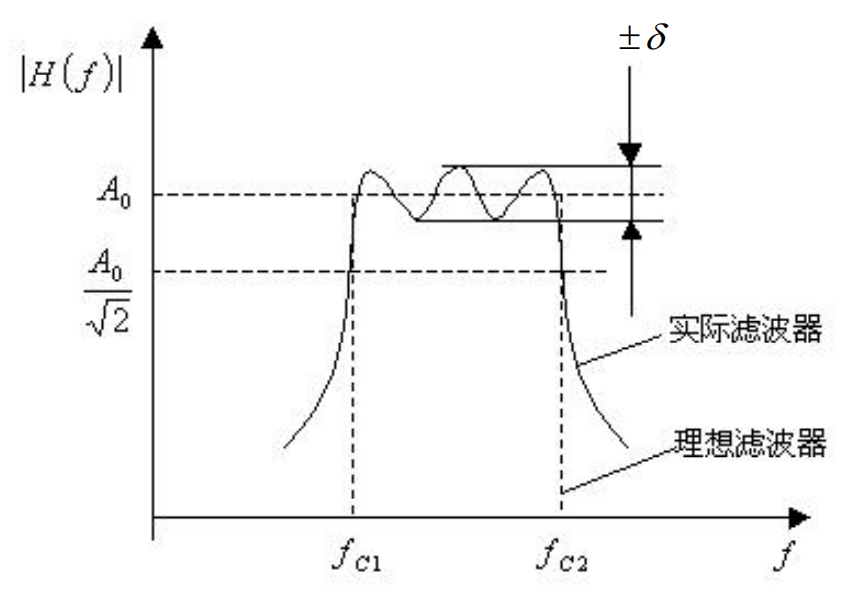

# 第四章 信号的调理与显示记录

## 直流电桥

### 直流电桥的基本概念

基本结构：电阻 $R_{1}, R_{2}, R_{3}, R_{4}$ 作为四个桥臂，在 $a, c$ 两端接入直流电源 $u_{o}$，在 $b, d$ 两端输出电压 $u_{y}$。

工作原理：利用四个桥臂中的一个或数个的阻值变化而引起电桥输出电压的变化。

平衡条件：$R_{1}R_{3} = R_{2}R_{4}$

### 输出特性

通常只考虑 $R_{1} = R_{2} = R_{3} = R_{4} = R$ 的情况：

$$
u_{y} = \frac{1}{4R} u_{0} (\Delta R_{1} + \Delta R_{3} - \Delta R_{2} - \Delta R_{4})
$$

### 输出特点

1. 输出电压和各桥臂电阻变化量的代数和成正比 
2. 和差特性（加减特性）
3. 供桥电压增大，容易引起蠕变和零漂
4. 增大电阻应变片的灵敏度可以提高电桥的输出电压

### 典型的直流电桥及其灵敏度计算

半桥单臂（单桥）、半桥双臂（半桥）、全桥差动（全桥）

::: tip 半桥、全桥相比于单桥，除了灵敏度外，还有什么优势？
半桥和全桥有温度补偿。
:::

### 电桥和差特性的应用

- 提高灵敏度
- 进行温度补偿，消除测量误差
- 复杂应力状态下测取单独由某一因素产生的应变

::: tip 什么是电桥的和差特性？
- 若相邻桥臂应变极性一致，则输出电压为两者之差；反之为两者之和。
- 若相对桥臂应变极性一致，则输出电压为两者之和；反之为两者之差。
:::

::: tip 如何利用和差特性测取单独因素产生的应变？
见课本P117 例 4-1
:::

### 电桥温度补偿原理

半桥测量时，可以使用桥路补偿法进行温度补偿。

采用完全相同的 $R_{1}$、$R_{2}$，处于相同温度场中，并且接入相邻臂。

则在力 $P$ 和温度 $t$ 下：

$$
\begin{align}
\frac{\Delta R_{1}}{R_{1}} &  = \left( \frac{\Delta R_{1}}{R_{1}} \right)_{{\varepsilon}} + \left( \frac{\Delta R_{1}}{R_{1}} \right)_{t} \\
\frac{\Delta R_{2}}{R_{2}} &  = \left( \frac{\Delta R_{2}}{R_{2}} \right)_{t}
\end{align}
$$
因为 $R_{1}$、$R_{2}$ 完全相同，且温度相同，故温度引起的电阻变化相同，故可得到温度补偿后的结果：

$$
u_{y} = \frac{u_{0}}{4} \left[ \left( \frac{\Delta R_{1}}{R_{1}} \right)_{\varepsilon} + \left( \frac{\Delta R_{1}}{R_{1}} \right)_{t} - \left( \frac{\Delta R_{2}}{R_{2}} \right)_{t} \right]
$$

## 调制与解调

### 调制基本概念

调制的目的：解决微弱缓变信号的放大以及信号的传输问题

调制的概念：利用某种低频信号来控制或改变某一高频信号的某个参数的过程
	- 载波：高频振荡信号
	- 调制信号：控制高频振荡的低频信号
	- 已调制信号：调制后的高频振荡信号
 
解调的目的：从已调制信号中恢复出原有低频调制信号的过程

调制种类：调幅（AM）、调频（FM）、调相（PM）

### 调幅调制与解调过程

调幅是将一个高频余弦信号与调制信号相乘，使载波信号幅值随调制信号的变化而变化

以 $y(t) = \cos (2\pi f_{0} t)$ 为载波，对调制信号 $x(t)$ 进行调制，得到调幅波 $x_{m}(t) = x(t) \cos (2\pi f_{0} t)$

$$
x_{m}(t) = x(t) \cdot \cos(2\pi f_{0} t) \Leftrightarrow X_{m}(f) =  \frac{1}{2}X(f - f_{0}) + \frac{1}{2} X(f + f_{0})
$$

:::: details 调幅推导过程

::: note 卷积的相关知识
卷积的定义

$$
x(t) * h(t) = \int _{-\infty}^{\infty} x(\tau) \cdot h(t - \tau) \, d \tau
$$

卷积定理

$$
\begin{cases}
x(t) \leftrightarrow  X(\omega) \\
h(t) \leftrightarrow H(\omega)
\end{cases} \to x(t) * h(t) \leftrightarrow X(f) * H(f)
$$
:::

::: note 
$\delta$ 函数见 [第一章 信号描述与分析基础](1-signal)
:::

$$
\begin{align}
x(t) \cdot y(t)  & \Leftrightarrow X(f) * Y(f) \\
y(t) = \cos(2\pi f_{0}t)  & \Leftrightarrow \frac{1}{2}\delta(f - f_{0}) + \frac{1}{2} \delta(f + f_{0}) \\
x(t) \cdot \cos(2\pi f_{0} t)  & \Leftrightarrow \frac{1}{2}X(f) * \delta(f - f_{0}) + \frac{1}{2} X(f) * \delta(f + f_{0}) \\
 & = \frac{1}{2}X(f - f_{0}) + \frac{1}{2} X(f + f_{0})
\end{align}
$$
::::

### 载波频率与最高频率

载波频率 $f_{0}$ 必须高于信号中的最高频率 $f_{max}$，否则会出现混叠现象（“混音”）。

实际应用中，载波频率至少在调制信号上限频率的十倍以上。

::: tip
调幅波是否可以看作是载波与调制信号的迭加？

答：不可以。因为调幅波是载波幅值随调制信号大小程正比变化，只有相乘再能实现。
:::

### 同步解调的分析

把调幅波再次与原载波信号相乘，随后用低通滤波器滤去大于 $f_{m}$ 的成分，则可以复现原信号的频谱，幅值为原来的一半。即：

$$
x_{m}(t) \cdot \cos(2\pi f_{0} t) = x(t) \cdot \cos 2(\pi f_{0}t) \cdot \cos (2\pi f_{0}t)
$$

## 信号滤波

### 滤波的分类及其幅频特性

低通滤波器、高通滤波器、带通滤波器、带阻滤波器

### 理想滤波器的特性

$$
H(f) = \begin{cases}
e^{-j\omega t_{0}} & |\omega| < \omega_{c} \\
0 & \text{其他}
\end{cases}
$$
脉冲响应函数 $H(j \Omega) \to h(t)$

### （重点）实际滤波器的基本参数

|       参数        | 描述                                                                                                                                                                                                                            |
|:-----------------:| ------------------------------------------------------------------------------------------------------------------------------------------------------------------------------------------------------------------------------- |
| 纹波幅度 $\delta$ | 通带中幅值特性值的起伏变化值                                                                                                                                                                                                    |
|     截止频率      | 幅频特性值等于 $\frac{A_{0}}{\sqrt{ 2 }}(-3dB)$  所对应的频率点                                                                                                                                                                 |
|     带宽 $B$      | 上下两截止频率之间的频率范围 $B = f_{c_{2}} - f_{c_{1}}$，又称 $-3dB$ 带宽                                                                                                                                                      |
|   品质因数 $Q$    | 对于一个带通滤波器，其品质因子 $Q$ 定义为中心频率 $f_{0}$ 与带宽 $B$ 之比，即 $Q = \frac{f_{0}}{B}$                                                                                                                             |
|   倍频程选择性    | 上截止频率 $f_{c_{2}}$ 与 $2f_{c_{2}}$ 之间或下截止频率 $f_{c_{1}}$ 与 $\frac{f_{c_{1}}}{2}$ 间幅频特性的衰减值，即频率变化一个倍频程的衰减量，以 $dB$ 表示。倍频程选择性表征过渡带的幅频曲线倾斜的程度，即幅频特性衰减的快慢。 |
| 滤波器因数（矩形系数）$\lambda$                  |  滤波器幅频特性的 $-60dB$ 宽带与 $-3dB$ 宽带的比，即 $\lambda = \frac{B_{-60dB}}{B_{-3dB}}$。对理想滤波器有 $\lambda = 1$，对普通使用的滤波器，$\lambda = 1 \sim 5$                                                                                                                                                                                                                               |

### RC 无源滤波电路

#### 一阶 RC 低通滤波器

$$
\begin{align}
A(f) = |H(f)| = \frac{1}{\sqrt{ 1 + (\tau 2\pi f)^{2} }} \\
\varphi(f) = -\arctan(2\pi f\tau)
\end{align}
$$

#### 一阶 RC 高通滤波器

$$
\begin{align}
A(f) = |H(f)| = \frac{2\pi f\tau}{\sqrt{ 1 + (\tau 2\pi f)^{2} }} \\
\varphi(f) = \arctan\left( \frac{1}{2\pi f\tau} \right)
\end{align}
$$

